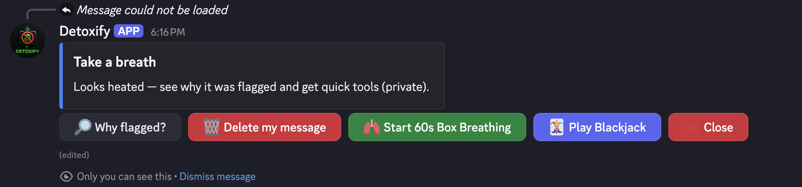
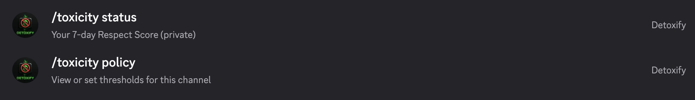

# Toxicity Coach (Lite)

[](https://github.com/<HarshPatel137>/<toxicity-coach>/actions)


A lightweight **Discord bot** that nudges conversations toward civility.

**Highlights**
- Lexicon-based detection (HurtLex); *no heavy ML deps*
- Always-flag categories: `PS, DDP, DDF, CDS, ASM, ASF`
- Whole-word + simple inflections & phrase support
- Threat & stereotype heuristics (“I will …”, “all X are …”)
- Private heads-up tools: *Why flagged, Delete, Breathing, Blackjack*
- Slash commands: `/toxicity status`, `/toxicity policy`, `/blackjack`

## Demos

**Private heads-up (only you see it)**  
[](docs/demo-heads-up.mov?raw=1)  
(docs/demo-heads-up.mov?raw=1)

_Explains why a message was flagged, offers Delete / Breathing / Blackjack cool-down._

**Slash commands**  
[](docs/demo-commands.mov?raw=1)  
(docs/demo-commands.mov?raw=1)

`/toxicity status` shows a civility meter & CSV; `/toxicity policy` edits per-channel thresholds.

## Quickstart
```bash
python3 -m venv .venv
source .venv/bin/activate
pip install -r requirements.txt
scripts/build_model.sh /path/to/hurtlex_EN.tsv
cp .env.example .env   # paste your token
python -m src.bot
